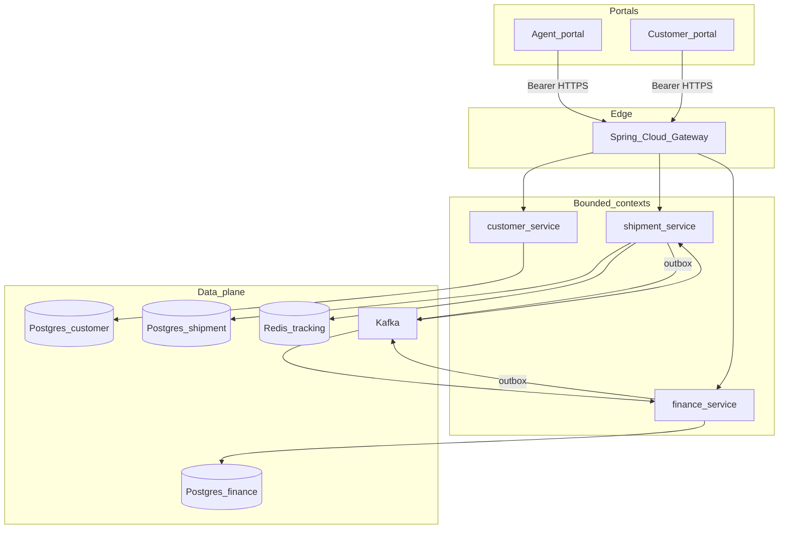
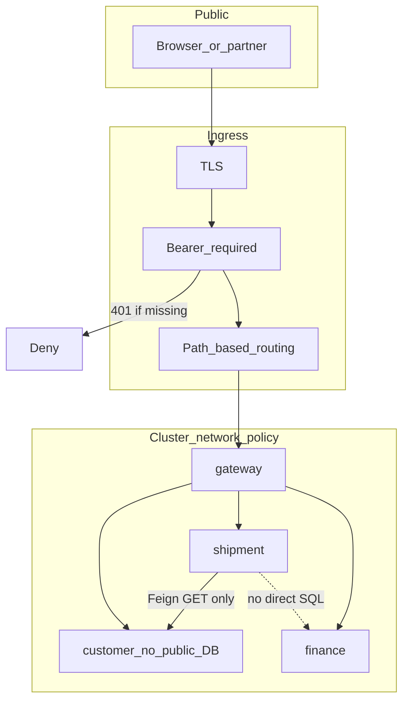
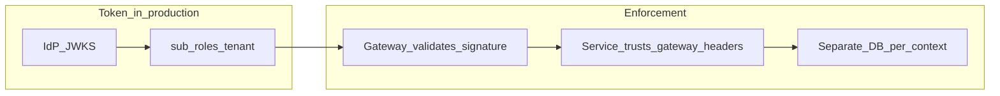
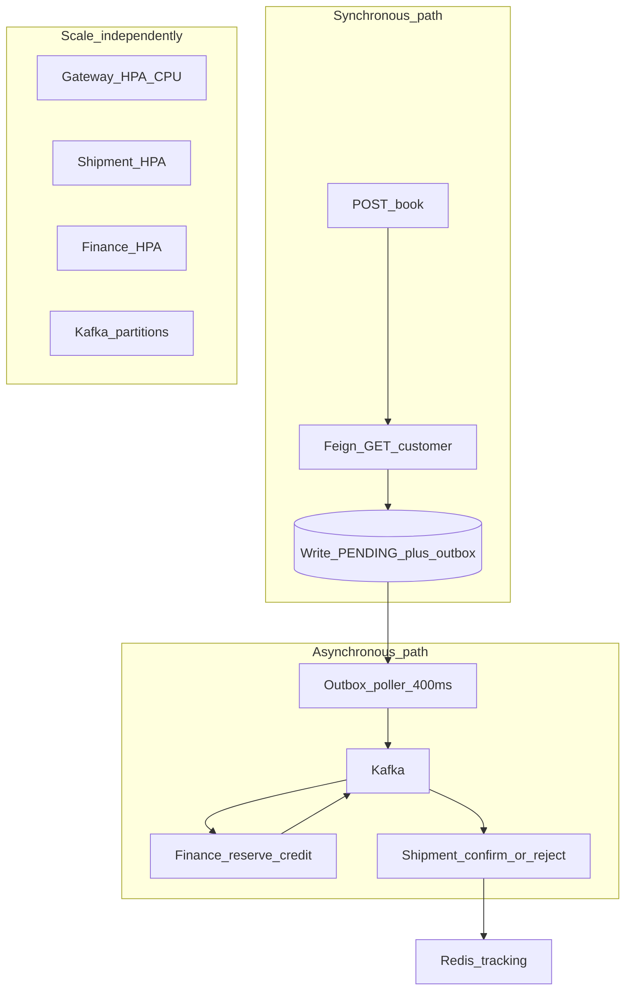
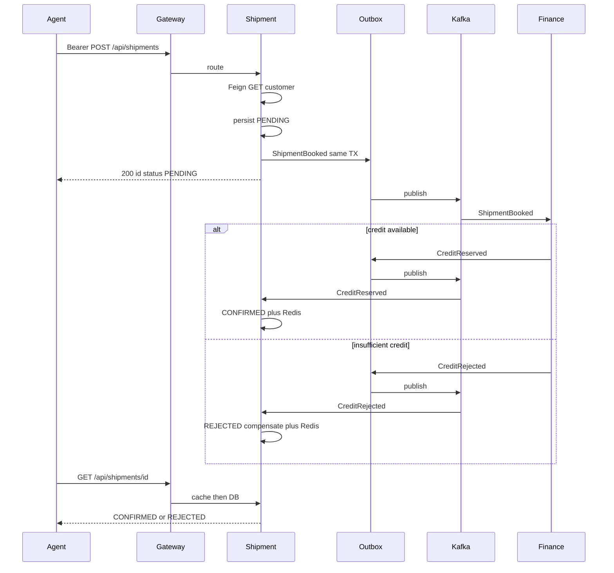
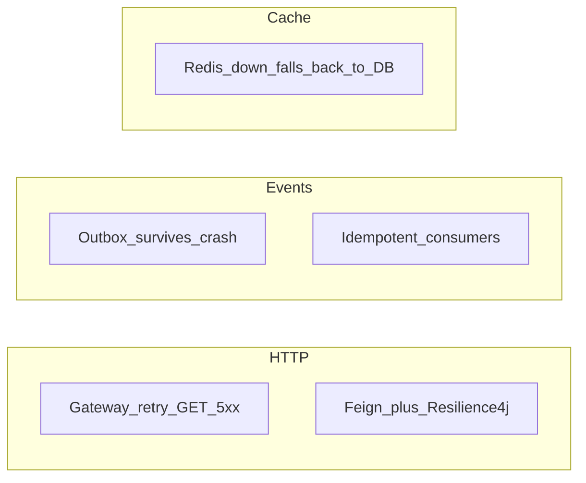
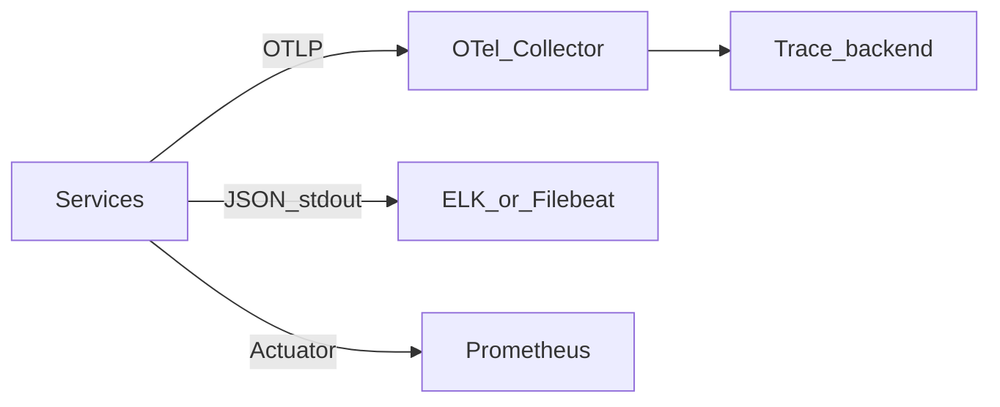

# Harbor Logistics Platform

Java **21** / Spring Boot **3.4** / Spring Cloud **2024.0** event-driven **logistics control plane**.

Original design for agent/customer booking, credit, and tracking. **Not** employer source and not a NetSuite/WSO2 clone.

| | |
| --- | --- |
| Stack | Gateway, OpenFeign, Kafka, Postgres outbox, Redis, Liquibase, OTel, Kubernetes |
| Hard problem | Booking + credit + tracking have **different consistency and scale** needs |
| Approach | Sync **reads** (Feign); async **writes** (outbox + choreography saga); cache tracking |

---

## System context

Agents never call finance or shipment databases. The gateway is the only public surface. Bounded contexts keep their own Postgres.



**Why not Eureka?** On EC2, client-side discovery was correct. On Kubernetes, DNS *is* discovery. See [ADR 0003](docs/adr/0003-no-eureka.md).

---

## Security — edge, blast radius, data

Harbor assumes the internet is hostile and **east-west traffic is still authenticated**. The repo ships a Bearer stub; production swaps it for JWKS.





| Control | In this repo | Production hardening |
| --- | --- | --- |
| Authentication | `BearerStubFilter` — missing Bearer → **401** | RS256 JWT vs IdP JWKS, short TTL, refresh rotation |
| Authorization | Demo token is a stand-in | Role claims: `AGENT` vs `CUSTOMER`; object-level checks on `customerId` |
| Service exposure | Only gateway is meant for Ingress | NetworkPolicy: pods cannot be reached from the internet |
| Dual-write / spoofed events | Outbox in the **same DB transaction** as the aggregate | Kafka ACL: only finance may produce `harbor.finance` |
| Replay / duplicates | `processed_event` in finance; status guard on shipment | Idempotency key on `POST /api/shipments` |
| Secrets | Env for JDBC / Kafka / Redis | External Secrets, RDS IAM, no connection strings in images |
| Data isolation | One database per service | Separate schemas + least-privilege DB users |
| Cache | Tracking TTL 10 minutes | Encrypt Redis at rest; do not cache PII without TTL + tenant key prefix |

Actuator is reachable for health in Compose; lock `/actuator/**` to the admin network in production.

---

## Scalability — split sync and async

Reads that must fail fast stay on HTTP. State that other contexts must observe goes through Kafka so finance and shipment scale independently.



| Bottleneck | Scale | Do not |
| --- | --- | --- |
| Edge QPS | Gateway replicas + CPU HPA | Put booking logic in the gateway |
| Tracking reads | Redis cache-aside, TTL | Hit Postgres on every poll from the portal |
| Credit reservation | Finance consumers × partitions | Two-phase HTTP from shipment to finance |
| Booking writes | Shipment replicas; outbox is per-row | Dual-write DB then Kafka |

Kubernetes HPA for shipment is in [`k8s/deploy.yaml`](k8s/deploy.yaml) (EC2 → Kubernetes story).

---

## Consistency — choreography saga

Booking is **not** a distributed lock. It is a documented eventually-consistent handshake.



Compensation is explicit: `REJECTED` is a first-class status, not a silent delete. Details: [ADR 0002](docs/adr/0002-choreography-saga.md), [ADR 0001](docs/adr/0001-outbox.md).

---

## Resilience



- Gateway retries **GET** on 5xx only (no retry on booking POST).
- If Redis is absent, `InMemoryTrackingCache` / DB read still serves tracking.
- Duplicate Kafka deliveries: finance ignores known `eventId`; shipment ignores non-`PENDING`.

---

## Observability



Correlation: `X-Correlation-Id` at the gateway; event `correlationId` on Kafka payloads.

---

## Bounded contexts

| Service | Responsibility | Sync | Async |
| --- | --- | --- | --- |
| `gateway-service` | Auth stub, routing, GET retries | HTTP | — |
| `customer-service` | Agent/customer master data | REST | — |
| `shipment-service` | Book + track | Feign to customer | Saga participant |
| `finance-service` | Credit reservation | REST snapshot | Saga participant |

## Quick start

```bash
mvn -q test
mvn -q -DskipTests package
docker compose up --build
```

Seeded customers: `C-ACME` (limit 10000), `C-POOR` (limit 100).

```bash
curl -s -X POST http://localhost:8080/api/shipments \
  -H 'Authorization: Bearer demo-token' \
  -H 'Content-Type: application/json' \
  -d '{"customerId":"C-ACME","origin":"DXB","destination":"LHR","amount":500}'
```

`GET /api/shipments/{id}` with the same Bearer header: `PENDING` → `CONFIRMED` or `REJECTED`.

## Design decisions

[docs/adr](docs/adr) — outbox vs Debezium, choreography vs orchestrator, DNS vs Eureka, Feign vs Kafka.

## License

Apache-2.0
