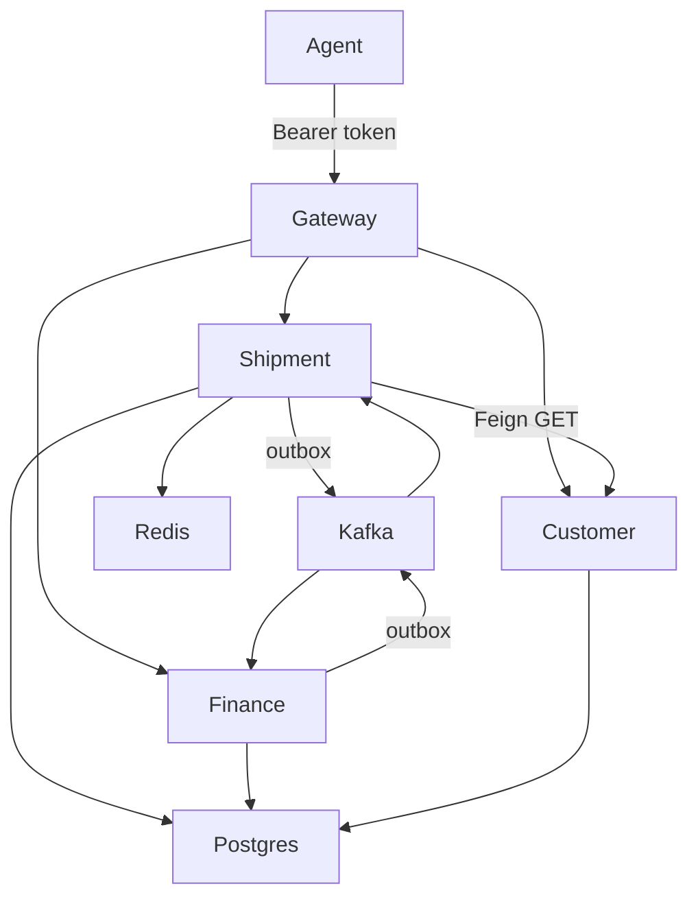

# Harbor Logistics Platform

Java **21** / Spring Boot **3.4** / Spring Cloud **2024.0** reference architecture for an **event-driven logistics backend**.

Original design inspired by agent/customer shipment platforms (quotes, booking, credit, tracking). **Not** employer source, and not a NetSuite/WSO2 clone.

## Why this repo exists

A logistics control plane is a poor CRUD monolith: booking, credit, and tracking have different scale and consistency needs. Harbor splits them and shows the patterns a principal engineer actually ships.



## Bounded contexts

| Service | Responsibility | Sync | Async |
| --- | --- | --- | --- |
| `gateway-service` | Edge auth stub, routing, retries | HTTP | — |
| `customer-service` | Agent/customer master data | REST | — |
| `shipment-service` | Book + track | Feign to customer | Kafka saga participant |
| `finance-service` | Credit reservation | REST snapshot | Kafka saga participant |

## Patterns in code

- **API Gateway** with Bearer stub (`BearerStubFilter`) — replace with JWKS in production
- **Transactional outbox** (`OutboxWriter` + `OutboxPublisher`)
- **Choreography saga** `ShipmentBooked` → credit → confirm/compensate
- **Redis cache-aside** for tracking (`RedisTrackingCache`, TTL 10m)
- **Idempotent finance** (`processed_event`)
- **Liquibase** per service database
- **OpenTelemetry collector** sidecar config for traces
- **Kubernetes** Deployments + HPA + Ingress (the EC2 → K8s story)
- **No Eureka** — [ADR 0003](docs/adr/0003-no-eureka.md)

## Quick start

```bash
mvn -q test
mvn -q -DskipTests package
docker compose up --build
```

Seeded customers: `C-ACME` (limit 10000) and `C-POOR` (limit 100).

```bash
# book a shipment that should confirm
curl -s -X POST http://localhost:8080/api/shipments \
  -H 'Authorization: Bearer demo-token' \
  -H 'Content-Type: application/json' \
  -d '{"customerId":"C-ACME","origin":"DXB","destination":"LHR","amount":500}'

# this one should reject after the saga
curl -s -X POST http://localhost:8080/api/shipments \
  -H 'Authorization: Bearer demo-token' \
  -H 'Content-Type: application/json' \
  -d '{"customerId":"C-POOR","origin":"DXB","destination":"LHR","amount":500}'
```

Polling `GET /api/shipments/{id}` (same Bearer header) shows `PENDING` → `CONFIRMED` or `REJECTED`.

JSON logs are ELK-ready (one line per event). Point Filebeat / OTel at container stdout.

## Design decisions

[docs/adr](docs/adr) — outbox vs Debezium, choreography vs orchestrator, DNS vs Eureka, Feign vs Kafka.

## License

Apache-2.0
